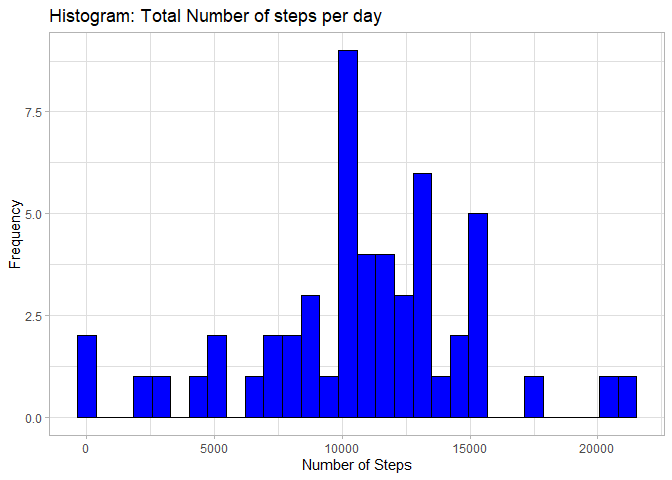
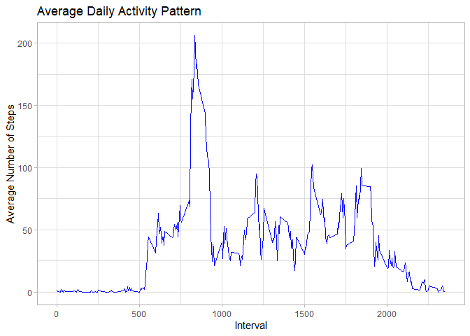
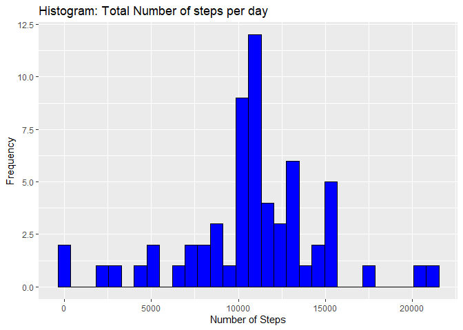
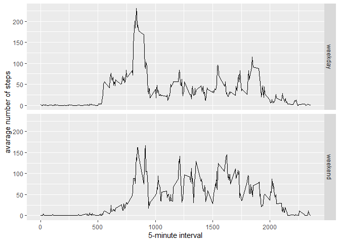

## Loading and preprocessing the data

```r
Datos <- read.csv("C://Coursera/Programa especializado Data Science - Johns Hopkins University/5. Reproducible Research/Semana2/Tarea calificada por pares/activity.csv")
head(Datos)
```

```
##   steps       date interval
## 1    NA 2012-10-01        0
## 2    NA 2012-10-01        5
## 3    NA 2012-10-01       10
## 4    NA 2012-10-01       15
## 5    NA 2012-10-01       20
## 6    NA 2012-10-01       25
```

```r
summary(Datos)
```

```
##      steps            date              interval     
##  Min.   :  0.00   Length:17568       Min.   :   0.0  
##  1st Qu.:  0.00   Class :character   1st Qu.: 588.8  
##  Median :  0.00   Mode  :character   Median :1177.5  
##  Mean   : 37.38                      Mean   :1177.5  
##  3rd Qu.: 12.00                      3rd Qu.:1766.2  
##  Max.   :806.00                      Max.   :2355.0  
##  NA's   :2304
```

```r
Datos$date <- as.Date(Datos$date, format = "%Y-%m-%d") 
```

## What is mean total number of steps taken per day?
For this part of the assignment, you can ignore the missing values in the dataset.

```r
PasosData<-Datos[!is.na(as.character(Datos$steps)),]
```
Calculate the total number of steps taken per day


```r
summStepts<-aggregate(PasosData$steps,by=list(PasosData$date),FUN=sum,na.rm=TRUE)
colnames(summStepts) <- c("date", "steps")
```
 Make a histogram of the total number of steps taken each day

```r
library(ggplot2)
gg1<-ggplot(summStepts, aes(x=steps)) 
gg1<-gg1+geom_histogram(color="black",fill="blue")
gg1<-gg1+ylab("Frequency")
gg1<-gg1+xlab( "Number of Steps")
gg1<-gg1+ggtitle("Histogram: Total Number of steps per day")
gg1<-gg1+theme_light()
gg1
```

```
## `stat_bin()` using `bins = 30`. Pick better value with `binwidth`.
```

<!-- -->

```r
## `stat_bin()` using `bins = 30`. Pick better value with `binwidth`.
```
Calculate and report the mean and median of the total number of steps taken per day

```r
mean(summStepts$steps)
```

```
## [1] 10766.19
```

```r
median(summStepts$steps)
```

```
## [1] 10765
```

## What is the average daily activity pattern?
Make a time series plot (i.e. type = “l”) of the 5-minute interval (x-axis) and the average number of steps taken, averaged across all days (y-axis)


```r
PasosPerInter<-aggregate(PasosData$steps,by=list(PasosData$interval),FUN=mean,na.rm=TRUE)
colnames(PasosPerInter) <- c("interval", "steps")

gg2<-ggplot(PasosPerInter, aes(x=interval, y=steps)) 
gg2<-gg2+geom_line(color="blue") 
gg2<-gg2+ylab("Average Number of Steps") 
gg2<-gg2+xlab("Interval") 
gg2<-gg2+ggtitle("Average Daily Activity Pattern") 
gg2<-gg2+theme_light()
gg2
```

<!-- -->

Which 5-minute interval, on average across all the days in the dataset, contains the maximum number of steps?


```r
PasosPerInter[which.max(PasosPerInter$steps),]$interval
```

```
## [1] 835
```

## Imputing missing values
Note that there are a number of days/intervals where there are missing values (coded as NA). The presence of missing days may introduce bias into some calculations or summaries of the data.

Calculate and report the total number of missing values in the dataset (i.e. the total number of rows with NAs)


```r
NumNA <- sum(is.na(as.character(Datos$steps)))
NumNA
```

```
## [1] 2304
```
Devise a strategy for filling in all of the missing values in the dataset. The strategy does not need to be sophisticated. For example, you could use the mean/median for that day, or the mean for that 5-minute interval, etc.


```r
NA_index<- which(is.na(as.character(Datos$steps)))
DatosSinNA<- Datos
DatosSinNA[NA_index, ]$steps<-unlist(lapply(NA_index, FUN=function(NA_index){
    PasosPerInter[Datos[NA_index,]$interval==PasosPerInter$interval,]$steps
}))
summary(DatosSinNA)
```

```
##      steps             date               interval     
##  Min.   :  0.00   Min.   :2012-10-01   Min.   :   0.0  
##  1st Qu.:  0.00   1st Qu.:2012-10-16   1st Qu.: 588.8  
##  Median :  0.00   Median :2012-10-31   Median :1177.5  
##  Mean   : 37.38   Mean   :2012-10-31   Mean   :1177.5  
##  3rd Qu.: 27.00   3rd Qu.:2012-11-15   3rd Qu.:1766.2  
##  Max.   :806.00   Max.   :2012-11-30   Max.   :2355.0
```

```r
str(DatosSinNA)
```

```
## 'data.frame':	17568 obs. of  3 variables:
##  $ steps   : num  1.717 0.3396 0.1321 0.1509 0.0755 ...
##  $ date    : Date, format: "2012-10-01" "2012-10-01" ...
##  $ interval: int  0 5 10 15 20 25 30 35 40 45 ...
```
Make a histogram of the total number of steps taken each day and Calculate and report the mean and median total number of steps taken per day. Do these values differ from the estimates from the first part of the assignment? What is the impact of imputing missing data on the estimates of the total daily number of steps?

```r
summDatosSinNA<-aggregate(steps ~ date,data=DatosSinNA,FUN=sum)
colnames(summDatosSinNA) <- c("date", "steps")
gg3<-ggplot(summDatosSinNA,aes(x=steps))
gg3<-gg3+ geom_histogram(color="black",fill="blue")
gg3<-gg3+ylab("Frequency")
gg3<-gg3+xlab( "Number of Steps")
gg3<-gg3+ggtitle("Histogram: Total Number of steps per day")
gg3
```

```
## `stat_bin()` using `bins = 30`. Pick better value with `binwidth`.
```

<!-- -->

```r
## `stat_bin()` using `bins = 30`. Pick better value with `binwidth`.
mean(summDatosSinNA$steps)
```

```
## [1] 10766.19
```

```r
median(summDatosSinNA$steps)
```

```
## [1] 10766.19
```

## Are there differences in activity patterns between weekdays and weekends?
For this part the weekdays() function may be of some help here. Use the dataset with the filled-in missing values for this part.

Create a new factor variable in the dataset with two levels – “weekday” and “weekend” indicating whether a given date is a weekday or weekend day.


```r
DatosSinNA$dateType <-  ifelse(as.POSIXlt(DatosSinNA$date)$wday %in% c(0,6), 'weekend', 'weekday')

averagedDatosSinNA <- aggregate(steps ~ interval + dateType, data=DatosSinNA, mean)
ggplot(averagedDatosSinNA, aes(interval, steps)) + 
    geom_line() + 
    facet_grid(dateType ~ .) +
    xlab("5-minute interval") + 
    ylab("avarage number of steps")
```

<!-- -->


